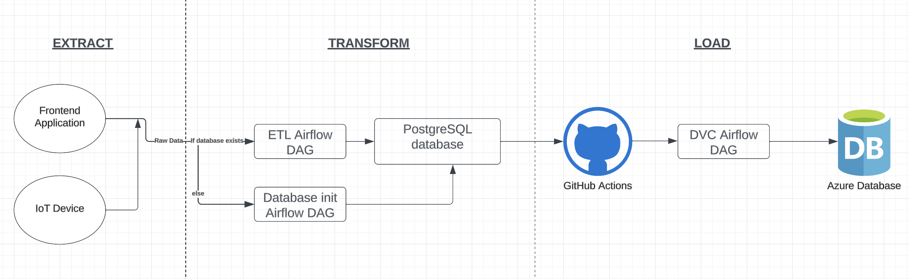

# backend-early-alzheimers

This repository contains the backend code for an early Alzheimer's detection data collection system utilizing distributed data pipelines. A detailed article of this project is available [here](https://medium.com/@ataul.akbar/cost-effective-data-collection-for-alzheimers-disease-prevention-distributed-data-pipeline-c5896424412b).


## Dataflow diagram

Hmmm instead of azure database maybe I should do [heroku postgres](https://www.heroku.com/pricing#containers)

## Requirements
Make sure you have docker installed. Follow this link to download it if you don't have it installed: https://www.docker.com/products/docker-desktop/.


## Credentials
Make a copy of .env.example file and name it .env, then add in your credentials.
``` bash
host = 'host.docker.internal'
port = '5432'
dbname = 'airflow'
user = 'airflow'
password = 'airflow'
```


## Docker instructions
- To build and start the container

``` bash
docker-compose up --build 
```

- To stop container

``` bash
docker-compose down 
```

## Airflow UI access
Type ``` localhost:8080 ``` on any browser to access the airflow webserver UI.


